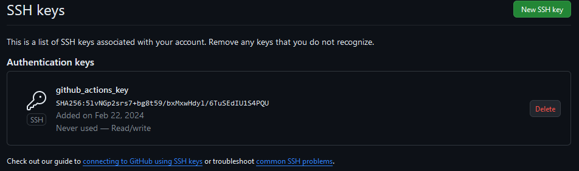
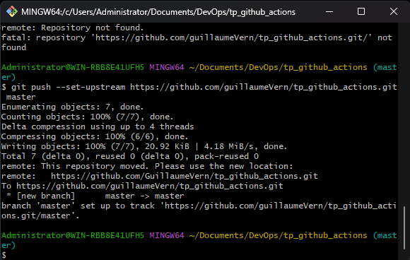
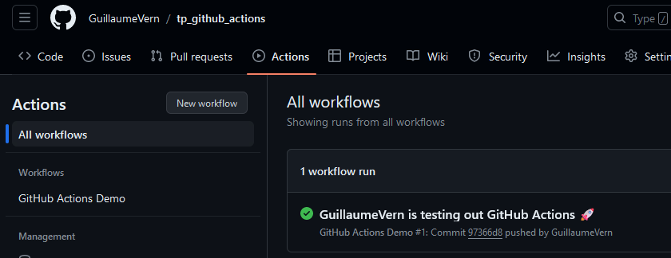
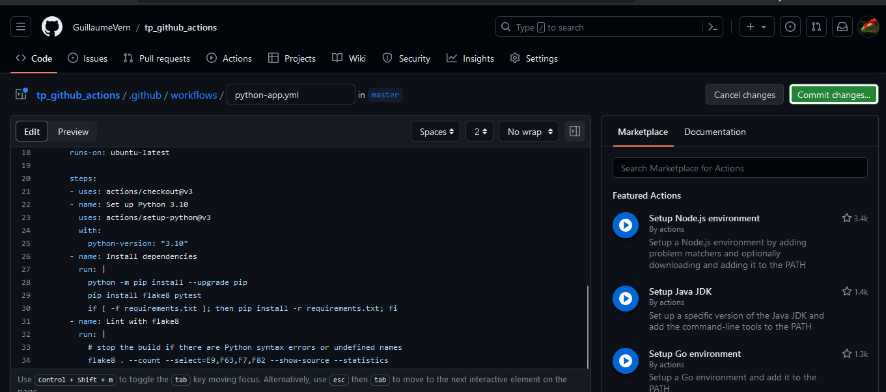
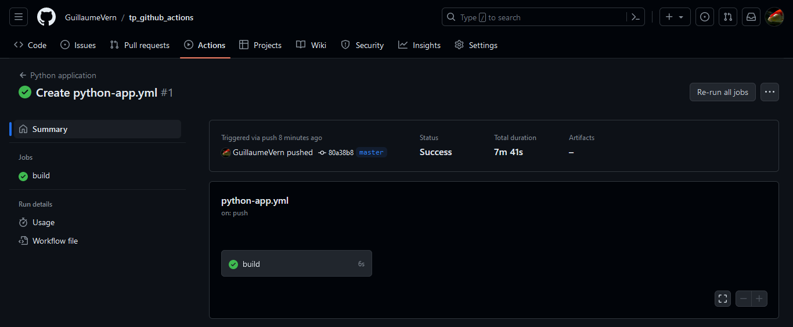
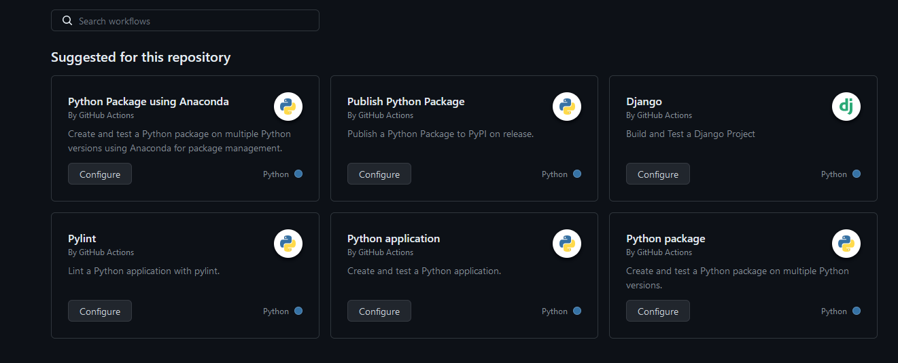
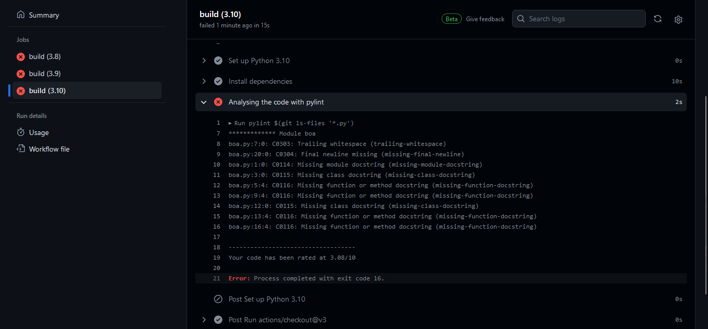
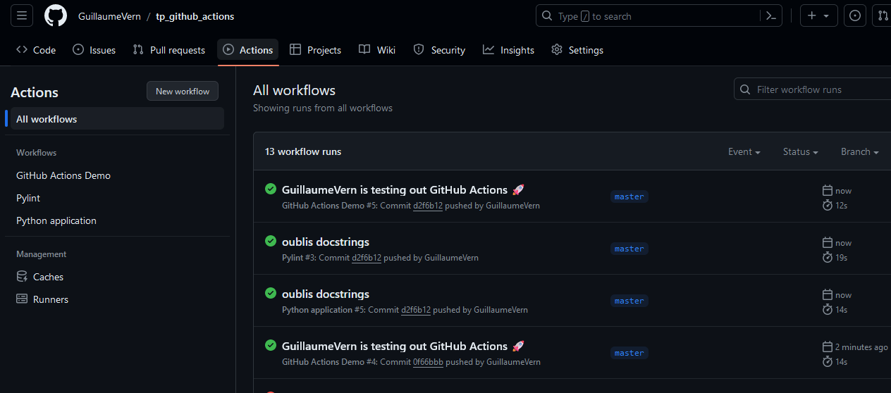

# TP Github Actions
### 1. liaison du compte 

la clé ssh est liée a mon compte github


### 2. test du premier workflow github actions

création du fichier .yml de config des actions dans .github/workflows/
puis commit sur un repo github:


on peut voir dans l'onglet "actions" que ça fonctionne


### 3. création des classes SimpleMath et TestSimpleMath en python

```py
import unittest

class SimpleMath:
    @staticmethod
    def addition(a, b):
        return a + b
    
    @staticmethod
    def soustraction(a, b):
        return a - b

class TestSimpleMath(unittest.TestCase):
    def test_addition(self):
        self.assertEqual(SimpleMath.addition(17, 12) , 29)

    def test_soustraction(self):
        self.assertEqual(SimpleMath.soustraction(8, 2), (6))
```

### 4. et 5. push sur github + création du workflow




le workflow s'est exécuté correctement lors du push suivant



### 6. ajout de l'étape de lint avec pylint



test du nouveau workflow avec un push


modification du code python pour etre conforme
```py
""" module to test the SimpleMath class """
import unittest

class SimpleMath:
    """
    A class that provides basic mathematical operations.
    """

    @staticmethod
    def addition(a, b):
        """
        Adds two numbers and returns the result.

        Parameters:
        a (int): The first number.
        b (int): The second number.

        Returns:
        int: The sum of the two numbers.
        """
        return a + b

    @staticmethod
    def soustraction(a, b):
        """
        Subtracts two numbers and returns the result.

        Parameters:
        a (int): The first number.
        b (int): The second number.

        Returns:
        int: The difference between the two numbers.
        """
        return a - b

class TestSimpleMath(unittest.TestCase):
    """
    A class that provides test cases for the SimpleMath class.
    """
    def test_addition(self):
        """
        Tests the addition method of the SimpleMath class.
        """
        self.assertEqual(SimpleMath.addition(17, 12) , 29)

    def test_soustraction(self):
        """
        Tests the soustraction method of the SimpleMath class.
        """
        self.assertEqual(SimpleMath.soustraction(8, 2), (6))

if __name__== "__main__":
    unittest.main()
```
toutes les actions sont ok


### 7. conteneur docker

ajout du lancement du conteneur dans le workflow
```yml
    - name: Building test container
      run: docker build -t "tp_workflow" .

    - name: Running test container
      run: docker run -it "tp_workflow"
```

test avec un push

